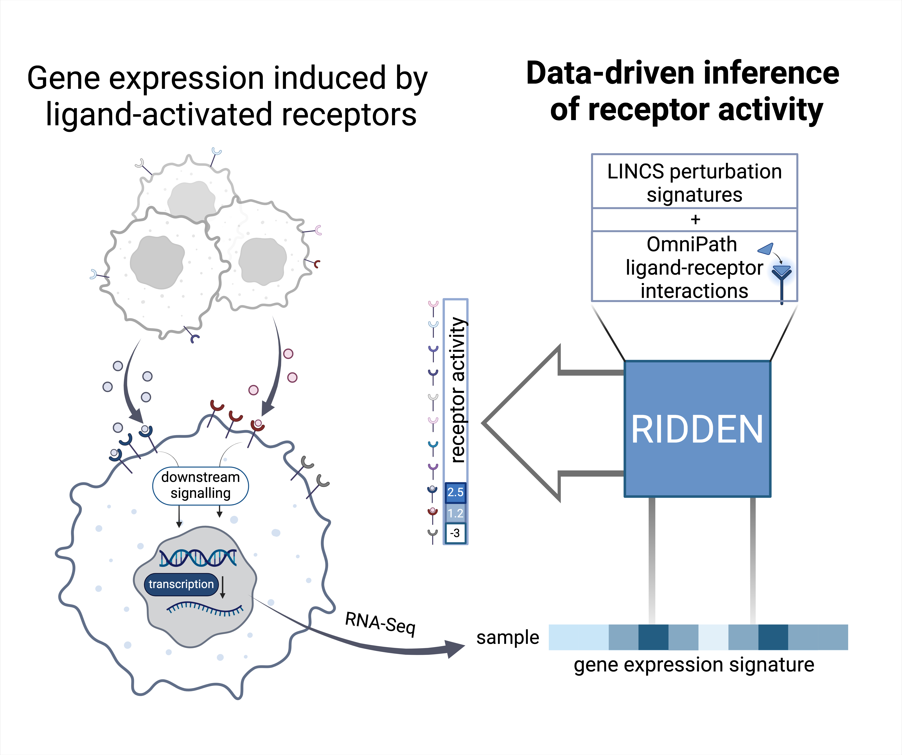

# RIDDEN: Data-driven inference of receptor activity from transcriptomic data

RIDDEN uniquely infers receptor activity from bulk- and single-cell transcriptomic data based on the expression of receptor-regulated genes, rather than the traditional approach of focusing on the expression levels of ligands and receptors.

To enable the inference of receptor activities, this tool combines the advantages of the prior knowledge of ligand-receptor interactions from the OmniPath resource (Türei et al., 2016, 2021) and a large collection of uniformly conducted and processed ligand and receptor perturbation gene expression experiments from The Library of Integrated Network-Based Cellular Signatures (LINCS) (Subramanian et al., 2017).

This repository contain the analysis files related to the publication.
The RIDDEN tool is available at [this repository](https://github.com/basvaat/RIDDEN_tool).

## Overview of the RIDDEN 

### Analysis pipeline and notebook description
- For construction of the RIDDEN model, the LINCS Level5 raw files were downloded from [clue.io/data](https://clue.io/data/CMap2020#LINCS2020) (sh, xpr, oe, cp, misc) 
- __Filtering and calculating consensus signatures:__
  - Query ligand-receptor interactions from OmniPath: `src/curated_ligand_receptor_interactions_omnipath.R`
  - Create receptor ligand associtation matrix: `notebooks/filtering/create_receptor_ligand_association_matrix_from_omnipath.ipynb`
  - Create metadata for LINCS compound data: `notebooks/filtering/create_compound_target_signed_metadata.ipynb`
  - Save LINCS ligand-receptor association matrix from gctx: `notebooks/filtering/save_lincs_ligand_receptor_perts_from_gctx.ipynb`
  - Create LINCS consensus from filtered data: `src/create_consensus.py`
  - For CytoSig validation, we created consensus signatures for not only the landmark genes, but for the inferred+landmark genes: `notebooks/filtering/high_quality_receptos_inferred_genes_consensus.ipynb`
  - Cross validation for filtering high quality receptors: `notebooks/benchmark/benchmark_against_other_lincs_perturbations_zscores.ipynb`
  - Create the model with high_quality receptors: `src/create_model.py` and `notebooks/model_creation/high_quality_receptors_model_z.ipynb`
 - Assigning confidence scores to the receptors: `notebooks/confidence_score/split_data_for_confidence_scores.ipynb` and `notebooks/confidence_score/calculate_confidence_scores_mwu.ipynb`

- __Model benchmark__
  - CytoSig: `notebooks/benchmark/benchmark_cytosig_rocauc_confidence.ipynb` (additional ligand mapping was created in: `notebooks/benchmark/cytosig_ridden_mapping.ipynb`)
  - cytokine signalling activities were calculated as described in the CytoSig paper
  - Receptor activities of Immune Dictionary samples: `notebooks/validation/immune_dictionary/cytokine_prediction.ipynb`

- __Evaluation__
  - Count receptor number per perturbation types `notebooks/qc/receptor_number_per_perttype.ipynb`
  - TF and receptor activities `notebooks/validation/biological_relevance/kegg_pathways_tfs_recs.ipynb`
  - Receptor type clustering `notebooks/validation/biological_relevance/receptor_type_clustering.ipynb`
  - TCGA and CCLE expression and activity correlation `notebooks/validation/biological_relevance/expression_activity_correlation.ipynb`
  - Bulk nivolumab-treated patient's data processing `notebooks/validation/anti_pd1/bulk/Braun_all.ipynb`   - the data was downloaded from the publication (Supplementary information)
  - Single-cell renal cell carcinoma data processing `notebooks/validation/anti_pd1/single_cell/sc_rcc_evaluation.ipynb`
  - the data was downloaded from GEO (accession number: GSE159115)

- __Figures__
  - `notebooks/figures.ipynb`

### References
Braun, D. A., Hou, Y., Bakouny, Z., Ficial, M., Sant’ Angelo, M., Forman, J., Ross-Macdonald, P., Berger, A. C., Jegede, O. A., Elagina, L., Steinharter, J., Sun, M., Wind-Rotolo, M., Pignon, J.-C., Cherniack, A. D., Lichtenstein, L., Neuberg, D., Catalano, P., Freeman, G. J., … Choueiri, T. K. (2020). Interplay of somatic alterations and immune infiltration modulates response to PD-1 blockade in advanced clear cell renal cell carcinoma. Nature Medicine, 26(6), 909–918.

Cui, A., Huang, T., Li, S., Ma, A., Pérez, J. L., Sander, C., Keskin, D. B., Wu, C. J., Fraenkel, E., & Hacohen, N. (2024). Dictionary of immune responses to cytokines at single-cell resolution. Nature, 625(7994), 377–384.

Jiang, P., Zhang, Y., Ru, B., Yang, Y., Vu, T., Paul, R., Mirza, A., Altan-Bonnet, G., Liu, L., Ruppin, E., Wakefield, L., & Wucherpfennig, K. W. (2021). Systematic investigation of cytokine signaling activity at the tissue and single-cell levels. Nature Methods, 18(10), 1181–1191.

Subramanian, A., Narayan, R., Corsello, S. M., Peck, D. D., Natoli, T. E., Lu, X., Gould, J., Davis, J. F., Tubelli, A. A., Asiedu, J. K., Lahr, D. L., Hirschman, J. E., Liu, Z., Donahue, M., Julian, B., Khan, M., Wadden, D., Smith, I. C., Lam, D., … Golub, T. R. (2017). A Next Generation Connectivity Map: L1000 Platform and the First 1,000,000 Profiles. Cell, 171(6), 1437–1452.e17.

Türei, D., Korcsmáros, T., & Saez-Rodriguez, J. (2016). OmniPath: guidelines and gateway for literature-curated signaling pathway resources. Nature Methods, 13(12), 966–967.

Türei, D., Valdeolivas, A., Gul, L., Palacio-Escat, N., Klein, M., Ivanova, O., Ölbei, M., Gábor, A., Theis, F., Módos, D., Korcsmáros, T., & Saez-Rodriguez, J. (2021). Integrated intra- and intercellular signaling knowledge for multicellular omics analysis. Molecular Systems Biology, 17(3), e9923.

Zhang, Y., Narayanan, S. P., Mannan, R., Raskind, G., Wang, X., Vats, P., Su, F., Hosseini, N., Cao, X., Kumar-Sinha, C., Ellison, S. J., Giordano, T. J., Morgan, T. M., Pitchiaya, S., Alva, A., Mehra, R., Cieslik, M., Dhanasekaran, S. M., & Chinnaiyan, A. M. (2021). Single-cell analyses of renal cell cancers reveal insights into tumor microenvironment, cell of origin, and therapy response. Proceedings of the National Academy of Sciences of the United States of America, 118(24). 

